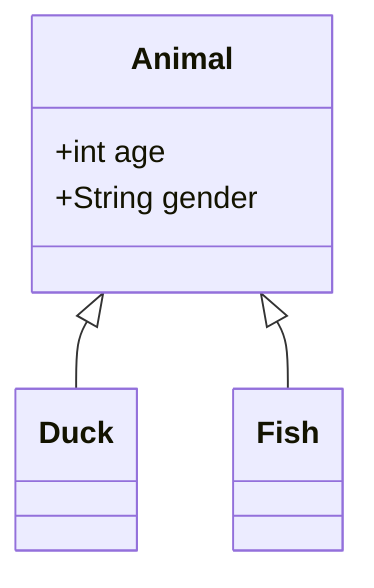
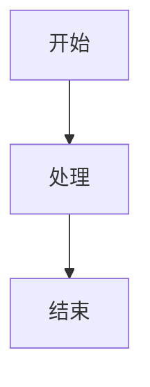

# 一、Brain-Computer Interfaces for Communication and Control   

EEG 研究主要围绕两种基本范式展开：

1. &nbsp;

```mermaid
classDiagram
    Animal <|-- Duck
    Animal <|-- Fish
    Animal : +int age
    Animal : +String gender
```

```mermaid
graph TD
    A[开始] --> B[处理]
    B --> C[结束]
```

&nbsp;